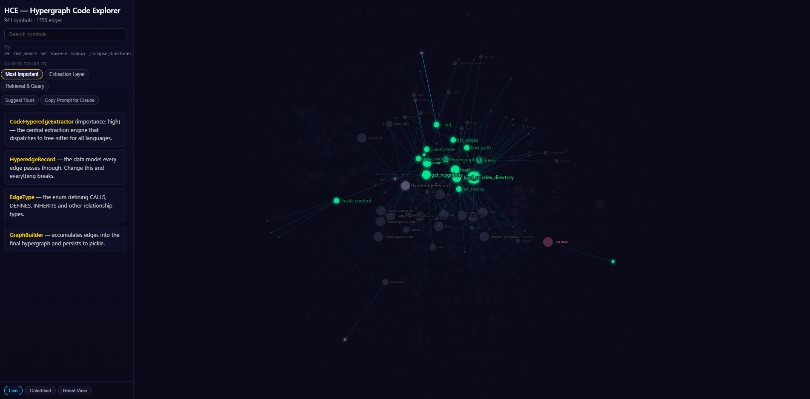

# Hypergraph Code Explorer (HCE)

Turn any codebase into an interactive visual map — for humans and AI agents alike. HCE indexes your project's structure — what calls what, what inherits from what, how everything connects — and makes it queryable in milliseconds. For people, it generates a navigable graph with guided tours that explain the architecture. For AI coding agents (Claude Code, Cursor, Codex, Cowork), it replaces expensive file-by-file exploration with instant structural queries, saving significant time and tokens. You don't need to be a programmer to use it. Just point Claude at a codebase and say "visualize this."



Supports Python, JavaScript, TypeScript, Go, Rust, Java, C, C++, Ruby, and PHP — including projects that mix several languages.

## Why Hypergraphs? Why AST?

Most tools that help AI understand code work by feeding source files into an LLM and asking it to figure out the structure. That burns tokens — lots of them. For a codebase like Django (1,163 files, 23,000+ symbols), an agent reading files one by one to trace how things connect could easily consume an entire context window and still miss the big picture.

HCE takes a fundamentally different approach. Instead of asking an LLM to *read* the code, it *parses* the code directly using tree-sitter, a fast multi-language AST (Abstract Syntax Tree) parser. Think of an AST as a precise structural blueprint of the code — it knows exactly where every function, class, call, and import is, without guessing. This parsing step is deterministic, costs zero LLM tokens, and finishes in seconds even for large codebases.

The parsed relationships get stored as a **hypergraph** — a graph where a single edge can connect more than two things at once. In a regular graph, you can only say "A calls B." In a hypergraph, one edge can capture "function A calls method B on class C with arguments D and E." This richer representation preserves context that pairwise graphs lose, and it's what makes queries like "what does this class call, two levels deep?" possible in milliseconds.

This project was inspired by [HyperGraphReasoning](https://github.com/lamm-mit/HyperGraphReasoning), which demonstrated the power of hypergraphs for AI reasoning over scientific literature. The key difference: HyperGraphReasoning uses LLM calls to *build* its graphs from documents. HCE doesn't — it uses AST parsing, which means the graph construction itself is free. The LLM tokens you save on indexing are then available for the work that actually matters: understanding the architecture, writing code, and answering questions. The hypergraph becomes a tool the AI agent *uses* rather than a thing it *builds*.

## Install the Skill

HCE works through a **skill** — a set of instructions that teaches Claude how to index codebases and build visualizations. You install the skill once, and then Claude knows how to use HCE whenever you ask.

### Option A: Cowork (desktop app — no coding required)

1. Download this repo (click the green **Code** button on GitHub → **Download ZIP**, or clone it if you're comfortable with git)
2. Open Cowork and select the folder you downloaded
3. Tell Claude: **"visualize this codebase"**

Claude will install HCE, index the code, and generate an interactive HTML visualization — all automatically. The skill is already in the `skill/` folder and Cowork picks it up.

To install the skill permanently so it works across any project:

1. Open the `skill/` folder in this repo
2. Zip its contents into a file called `hce-visualize.skill`
3. In Cowork, go to **Settings → Skills** and add the `.skill` file

### Option B: Claude Code (terminal)

Copy the skill to your Claude Code skills directory:

```bash
git clone https://github.com/denson/hypergraph_code_explorer.git
cp -r hypergraph_code_explorer/skill ~/.claude/skills/hce-visualize
```

Then in any project, tell Claude Code: **"visualize this codebase"** and the skill takes over.

### What happens when you use it

1. Claude installs HCE (a Python tool) if it isn't already installed
2. It indexes the codebase — scanning every file to map out symbols, calls, and relationships
3. It researches the architecture using graph queries (no token-burning file reads)
4. It designs guided tours explaining the major subsystems
5. It generates a self-contained HTML file you can open in any browser

The visualization includes search, guided tours with click-to-spotlight, a "Suggest Tours" button for discovering more areas to explore, and a "Copy Prompt for Claude" button that lets you ask Claude for additional tours.

---

## For Developers

Everything below is for people who want to use HCE directly from the command line, integrate it into their own tools, or contribute to the project.

### Quick Start

```bash
pip install -e .

# Index a codebase (point at the source root, not the repo root)
hce index ./my-project/src/my_package --skip-summaries

hce lookup MyClass              # find a symbol
hce lookup MyClass --calls      # what does it call?
hce search "authentication"     # search by concept
hce query "how does request validation work"   # natural language
hce stats --cache-dir ./my-project/src/my_package/.hce_cache
```

The `--skip-summaries` flag keeps the entire pipeline zero-cost (no API calls). The index saves to `.hce_cache/` inside the source root and persists across sessions.

### What It Indexes

HCE uses tree-sitter to extract seven types of structural relationships from source code:

| Edge Type | What It Captures | Example |
|-----------|-----------------|---------|
| CALLS | Function/method call sites | `Session.send` → `HTTPAdapter.send` |
| IMPORTS | Import statements | `routing` → `starlette.routing` |
| DEFINES | Class/function definitions | `FastAPI` → `FastAPI.__init__`, `FastAPI.get` |
| INHERITS | Class inheritance | `FastAPI` → `Starlette` |
| SIGNATURE | Parameter types | `Depends(dependency, use_cache)` |
| RAISES | Exceptions raised | `validate()` → `ValidationError` |
| DECORATES | Decorator usage | `@dataclass` → `Depends` |

Each edge is a **hyperedge** — it can connect more than two nodes. A single CALLS edge captures caller, callee, and all arguments, giving richer context than pairwise edges.

### Commands

**`hce index <path>`** — Index a source directory. Points at the package root, not the repo root. Finding the source root: check `pyproject.toml`, `package.json`, `go.mod`, or `Cargo.toml`.

**`hce lookup <symbol>`** — Exact symbol lookup. Add `--calls` to see what it calls. For class nodes, `--calls` automatically expands through methods.

**`hce search "<terms>"`** — Text/substring search across all node names. Good for discovery.

**`hce query "<question>"`** — Natural language query. Runs multi-tier retrieval (exact lookup → structural traversal → text search).

**`hce stats`** — Graph statistics: node count, edge count, edge types, hub nodes.

**`hce overview`** — High-level codebase map: key symbols, call chains, inheritance trees.

### Scale

| Codebase | Files | Nodes | Edges | Hub Nodes | Index Time |
|----------|-------|-------|-------|-----------|------------|
| requests | 18 | 906 | 485 | 11 | ~3s |
| FastAPI | 48 | 1,264 | 1,214 | 13 | ~9s |
| Django | 1,163 | 23,614 | 19,382 | 103 | ~196s |

### Optional Features

**Embeddings (Tier 4 semantic search):** `pip install -e ".[embed]"` then `hce embed --cache-dir .hce_cache`

**MCP Server:** `pip install -e ".[server]"` then `hce server` — exposes HCE as MCP tools.

**LLM Summaries:** Run `hce index` without `--skip-summaries` (requires `ANTHROPIC_API_KEY` in `.env`).

### Architecture

See [ARCHITECTURE.md](ARCHITECTURE.md) for internals: data structures, tiered retrieval system, edge types, module dependency order, and MCP tool schemas.

### Development

```bash
pip install -e ".[all]"
pip install pytest
pytest
```

### Limitations

- **Supported languages.** Python, JavaScript, TypeScript, Go, Rust, Java, C, C++, Ruby, and PHP via tree-sitter. Other languages get basic regex extraction (DEFINES + IMPORTS only).
- **Static analysis.** Dynamic dispatch, monkey-patching, and `getattr()` magic aren't captured.
- **Structure, not semantics.** The graph tells you *what calls what* but not *why*. You still need to read the code for business logic.
